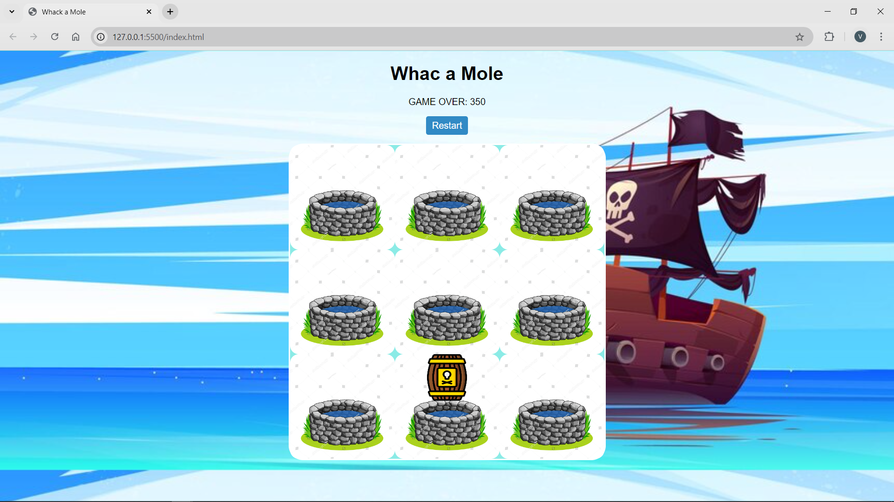

# Whack-a-Chest Game

Welcome to the Whack-a-Chest game! In this interactive game, players earn points by clicking on treasures while avoiding barrels. The game is designed to be simple yet engaging, making it a great way to improve your reflexes!

## Demo

## Installation

1. Clone the project repository.
2. Open the `index.html` file with your web browser.

## How to Play

1. **Start the Game:** Open the game in your web browser.
2. **Click on Treasures:** Click on the treasure chests as they appear to earn points (10 points per mole).
3. **Avoid Barrels:** Be careful not to click on the barrels, as doing so will end the game.
4. **Watch Your Score:** Your current score will be displayed at the top of the game board.

## Technologies Used

- **HTML:** For structuring the game layout.
- **CSS:** For styling the game elements.
- **JavaScript:** For game logic and interactivity.

## Acknowledgments

- Inspired by classic whack-a-mole games.
- Thanks to Kenny Yip Coding for the tutorials.
